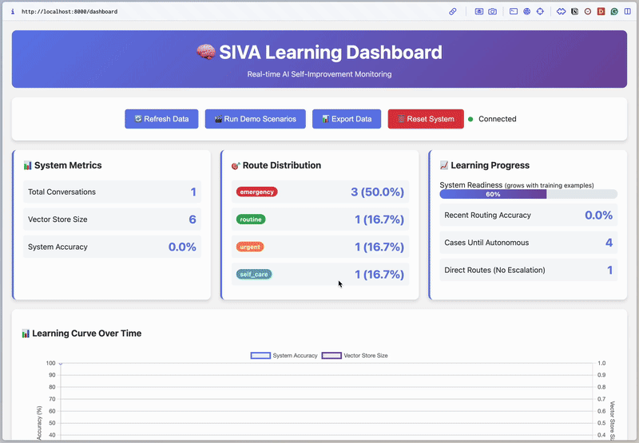
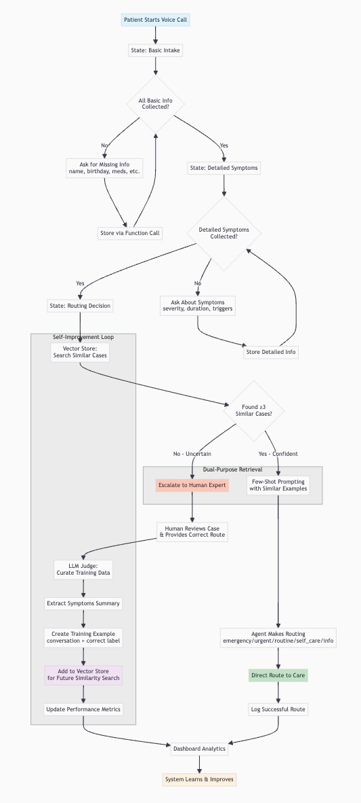

# SIVA - Self-Improving Voice Agent Framework

A modular, **self-improving voice agent framework** that **learns from expert feedback**, extracts important concepts from conversations in **real-time** and validates predictions with a local vector db of similar cases (used for few-shot prompting and confidence assessment) and optionally public knowledge sources.



## 🚀 Quick Start

**Requirements:** Python 3.10+, [uv](https://docs.astral.sh/uv/) package manager, browser with microphone access

1. **Setup Environment:**
   ```bash
   uv venv .venv && source .venv/bin/activate
   uv pip install -r requirements.txt
   ```

2. **Configure API Keys** (`.env` file):
   ```
   OPENAI_API_KEY=sk-your-key-here
   CARTESIA_API_KEY=your-cartesia-key-here
   DOMAIN_API_KEY=your-domain-specific-key-here  # For domain-specific evidence sources
   ```

3. **Launch the Voice Agent:**
   ```bash
   python run_voice_app.py
   ```
   Opens the voice client at [http://localhost:3000/voice_client.html](http://localhost:3000/voice_client.html) and dashboard at [http://localhost:8000/dashboard](http://localhost:8000/dashboard) 


## 🎯 Use Cases & Applications

### 🏥 Medical: Automated patient intake 
**Current Implementation**: Patient intake and triage with "clinical pearl" (de-identified clinical decisions and reasonings) extraction

**Key Features:**
- **Voice-driven patient intake** with symptom analysis
- **5-category routing system** (Emergency, Urgent, Routine, Self-Care, Information)
  - **🚨 Emergency**: Life-threatening conditions (chest pain, stroke signs, difficulty breathing)
  - **⚡ Urgent**: Serious but not immediately life-threatening (high fever, severe pain)
  - **📅 Routine**: Ongoing or non-urgent issues (mild symptoms, follow-ups, preventive care)
  - **🏠 Self-Care**: Minor issues manageable at home (mild cold, minor headache)
  - **ℹ️ Information**: Questions about medication, prevention, or general health advice
- **Key clinical decisions and reasoning detection** from expert corrections and conversation transcripts (aka "clinical pearls")

**Value Proposition**: Captures unwritten clinical wisdom from physician conversations with zero overhead.

## 🔄 Self-Improvement Process



## 🔧 System Architecture

### Core Components
- **Frontend**: Pure HTML/JavaScript voice client with real-time audio streaming
- **Backend**: FastAPI server with conversational state management
- **Learning Stack**: Vector store + LLM judge + data manager for continuous improvement
- **Domain Adapters**: Pluggable modules for different use cases

### AI Models & Usage

#### **🎤 Speech Processing**
- **STT**: OpenAI **Whisper v1** (`whisper-1`) - Converts speech to text with high accuracy
- **TTS**: Cartesia **Sonic-2** (`sonic-2`) - Natural voice synthesis for agent responses

#### **🧠 Language Models**
- **Main Conversation Agent**: OpenAI **GPT-3.5 Turbo 1106** (`gpt-3.5-turbo-1106`)
  - **Function Calling**: Structured data extraction and domain-specific processing
  - **State Management**: Progressive conversation phases
  - **Decision Making**: Domain-specific recommendations with reasoning
  - **Temperature**: 0.3 (balanced accuracy/creativity), Max tokens: 300

- **LLM Judge**: OpenAI **GPT-3.5 Turbo** (`gpt-3.5-turbo`)
  - **Feedback Analysis**: Extracts key insights from expert corrections
  - **Knowledge Extraction**: Identifies patterns and pearls from interactions
  - **Data Curation**: Transforms conversations into structured training examples

#### **🔍 Vector Similarity System**
- **Embedding Model**: OpenAI **text-embedding-3-small** (`text-embedding-3-small`)
  - **Purpose**: Converts conversations to 1536-dimensional vectors for similarity search
  - **Similarity Computation**: Cosine similarity via scikit-learn
  - **Threshold**: 0.75 minimum similarity for "similar cases"
  - **Retrieval**: Top-5 similar cases for few-shot prompting

## 📊 Dashboard Monitoring

Real-time dashboard tracking: total conversations, vector store size, system accuracy, route distribution, learning progress, and recent activity. Access at [http://localhost:8000/dashboard](http://localhost:8000/dashboard) (auto-opens when using `run_voice_app.py`).

## 🛠 Development & Testing

**Debug Conversations** (without voice):
```bash
python debug_conversation.py
```

**Learning Progression Demo**:
```bash
python learning_demo.py
```

**Separate Server Mode**:
```bash
# Terminal 1 - Backend
uvicorn main:app --host localhost --port 8000 --reload

# Terminal 2 - Voice Client  
python serve_client.py
```

## 📁 Project Structure

```
siva/
├── main.py                    # FastAPI backend with domain-agnostic routing
├── run_voice_app.py           # Unified launcher
├── voice_client.html          # Voice interface
├── vector_store.py            # Experience-based evidence storage
├── llm_judge.py               # Evaluation and knowledge extraction
├── data_manager.py            # Persistent data storage
├── learning_demo.py           # Improvement demonstration
├── dashboard.html             # Performance & learning intelligence monitoring
├── framework/                 # Core framework components
│   ├── config.py              # Framework configuration
│   ├── domain_knowledge_adapter.py # Domain-specific knowledge integration
│   ├── dual_purpose_vector_store.py # Enhanced vector storage
│   ├── learning_pipeline.py   # Core learning mechanisms
│   └── voice_interface.py     # Voice processing utilities
├── applications/              # Domain-specific implementations
│   ├── clinical_pearls/       # Medical use case
│   │   ├── clinical_pearls_app.py
│   │   └── openevidence_simple.py
│   └── patient_intake/        # Patient intake system
│       └── patient_intake_app.py
├── examples/                  # Framework usage examples
│   ├── framework_demo.py      # General framework demonstration
│   └── simple_framework_demo.py
├── intake_logs/               # Conversation history
└── siva_data/                # Learning database + knowledge pearls
```


**SIVA transforms voice interactions into continuously improving AI systems, capturing domain expertise and building collective intelligence across any field.**
